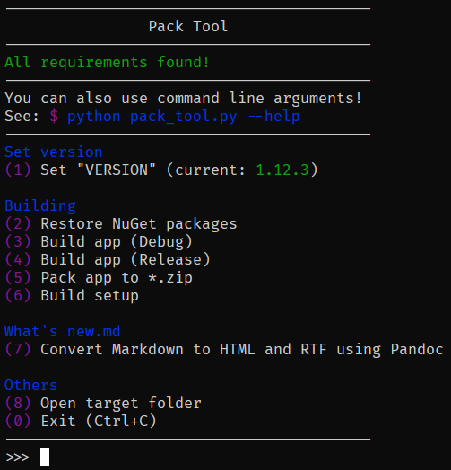

# Build process

- [Build process](#build-process)
  - [Manual build process](#manual-build-process)
    - [Requirements](#requirements)
    - [Building the application manually](#building-the-application-manually)
    - [Building the setup manually](#building-the-setup-manually)
  - [Use my build script `pack_tool.py`](#use-my-build-script-pack_toolpy)
    - [Requirements](#requirements-1)
    - [Running the script](#running-the-script)

## Manual build process

### Requirements
- Windows 10 or later
- [Visual Studio 2022 Community edition](https://visualstudio.microsoft.com/vs/community/)
    - [".NET Desktop Development" workload installed](https://learn.microsoft.com/en-us/visualstudio/install/modify-visual-studio?view=vs-2022)
- [Inno Setup](https://jrsoftware.org/isdl.php) (optional, needed to build the installer)

### Building the application manually
1. Open the solution `Fallout76-QuickConfiguration\Fo76ini\Fo76ini.sln` in Visual Studio 2022.
2. Set the build target to "Release", "Any CPU", and "Fo76ini_Updater"
3. Click Build → Build Solution (F6)
4. Copy (and replace) the content of `Fallout76-QuickConfiguration\Fo76ini_Updater\bin\Release\` into  `Fallout76-QuickConfiguration\Fo76ini\bin\Release\`. (Create the latter directory, if it does not exist)
5. Next, set the build target to "Release", "Any CPU", and "Fo76ini"
6. Once again, click Build → Build Solution (F6)
7. Copy the content of `Fallout76-QuickConfiguration\Additional files\` into `Fallout76-QuickConfiguration\Fo76ini\bin\Release\`
8. Done.

### Building the setup manually
1. Open `Fallout76-QuickConfiguration\setup.iss` in Inno Setup Compiler.
2. Edit the first few lines, such as `ProjectVersion` and `ProjectGitDir`
3. You'll probably also need to edit these lines:
    ```
    [Files]
    Source: "{#ProjectGitDir}\Publish\v{#ProjectVersion}\Fo76ini.exe"; DestDir: "{app}"; Flags: ignoreversion
    Source: "{#ProjectGitDir}\Publish\v{#ProjectVersion}\*"; DestDir: "{app}"; Flags: ignoreversion recursesubdirs createallsubdirs
    ; NOTE: Don't use "Flags: ignoreversion" on any shared system files
    ```
    to something like this:
    ```
    [Files]
    Source: "{#ProjectGitDir}\Fo76ini\bin\Release\Fo76ini.exe"; DestDir: "{app}"; Flags: ignoreversion
    Source: "{#ProjectGitDir}\Fo76ini\bin\Release\*"; DestDir: "{app}"; Flags: ignoreversion recursesubdirs createallsubdirs
    ; NOTE: Don't use "Flags: ignoreversion" on any shared system files
    ```
4. Build the setup.

## Use my build script `pack_tool.py`

### Requirements
First, install all requirements from the "Manual build process" section.

Next, install these additional requirements for this build script:
- [Python 3.3 or newer](https://www.python.org/downloads/)
- [rcedit](https://github.com/electron/rcedit)
- [7-Zip](https://www.7-zip.org/download.html)
- [Pandoc](https://pandoc.org/installing.html)

I recommend installing these using scoop:
```powershell
Set-ExecutionPolicy RemoteSigned -Scope CurrentUser
irm get.scoop.sh | iex
scoop bucket add extras
scoop install 7zip python rcedit inno-setup pandoc
python -m pip install colorama
```
*(Paste this line by line into a PowerShell window)*

### Running the script
When you open a terminal in the folder containing the script and run `python pack_tool.py`, you should see something like this:


From here, you can simply build the app and it should put the result into the folder `Publish`.

The script has an interactive mode (which you can see in the screenshot) that starts when no command line arguments are supplied.

If you want to build the app for release quickly, enter this: `python pack_tool.py -b -p -s`  
This will build the app, pack it into a zip, and build the setup.